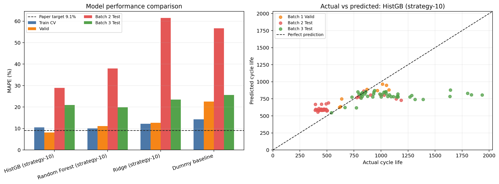

# ESS 배터리 수명 예측

초기 100 Cycle 데이터로 리튬이온 배터리의 Cycle Life를 예측해, ESS 배터리 교체 시점을 미리 판단할 수 있는지 확인한다.


## 프로젝트 개요
- 데이터셋 : MIT-Stanford Battery Dataset (Severson et al., Nature Energy 2019)
- 학습 데이터 : Batch 1 (2017-05-12)
- 평가 데이터 : Batch 2 (2018-02-20), 추가 검증 Batch 3 (2018-04-12)
- 태스크 : Regression (Cycle Life 예측)
- Target : 방전 용량이 0.88Ah(SOH 80%)에 도달한 Cycle 수, log10 변환 후 학습
- 평가지표 : MAPE


## 파일 구조
```
├── data/DATA_README.md                    # 원본 .mat 다운로드 안내
├── outputs/
│   ├── DS-MINI-Day1-EDA-analysis.py       # DAY1 EDA, Feature 생성
│   ├── day1_final_*.csv / *.png           # DAY1 Feature, EDA 결과
│   ├── final_regression_pipeline.py       # DAY2 학습·평가
│   ├── regression_pipeline.py             # 실행 파일
│   ├── day2_*.csv / *.png                 # DAY2 성능표, 오류 분석, 그래프
│   ├── DAY2_README.md                     # DAY2 상세 결과
│   └── DS-MINI-Design-울산_1반-김희윤.pdf  # 보고서
├── requirements.txt
└── README.md
```


## 환경 설정
```bash
git clone https://github.com/khytbob02-lab/ess-battery-project.git ess-battery-project
cd ess-battery-project

python3 -m venv .venv          # 가상환경 생성 (Python 3.10 이상)
source .venv/bin/activate      # 가상환경 활성화 (Windows: .venv\Scripts\activate)
pip install -r requirements.txt

python outputs/regression_pipeline.py
```
검증 환경 : Python 3.12, numpy 2.4, pandas 3.0, scikit-learn 1.8
실행하면 `outputs/`에 결과가 저장되고, 이 README와 DAY2_README의 성능 수치가 함께 갱신된다.


## EDA

- Cycle Life 분포
	- 평균(중앙값) : Batch 1 788(773), Batch 2 566(472), Batch 3 1,060(1,006) Cycle
	- 단수명(<500) 비율 : Batch 1 0%, Batch 2 72%, Batch 3 0%
	- 이상치(IQR 기준) : Batch 1에는 이상치가 없다. Batch 2의 이상치 9개와 Batch 3의 이상치 3개는 모두 `newstructure` 셀이고, 짧은 쪽이 아니라 유독 긴 쪽이다.
	- 가장 짧은 셀 : Batch 2의 392~416 Cycle 셀들이다. Batch 2에서는 짧은 수명이 예외가 아니라 일반적인 경우다. Batch 1에서 가장 짧은 4개 셀은 80%까지 평균 충전속도가 5.1C로 나머지(4.5C)보다 빨랐고 1단계 C-rate도 6.7C vs 6.0C로 높았다. 온도(32.8°C vs 33.1°C)와 내부저항은 차이가 없어, 짧은 수명은 고속 충전과 더 관련이 있다.
	- 핵심 발견 : Batch 2에 단수명 셀이 몰려 있어 Batch 1과 분포가 가장 다르다. Target은 log로 변환하고 Batch 2는 독립 Test로 둔다.

- 열화 곡선 분석
	- 열화 속도는 일정하지 않고 가속된다. Cycle 10~100의 용량 기울기는 단수명(<550)과 장수명(>1,000) 모두 0에 가깝다. EOL 직전 100 Cycle에서는 단수명 −1.55, 장수명 −0.75 mAh/cycle로 빨라지고, 단수명이 약 2배 빠르게 떨어진다.
	- Knee 중앙값은 Batch 1 550, Batch 2 339, Batch 3 764 Cycle(수명의 71~76% 지점)이고, 100 Cycle 이전에 Knee가 온 셀은 없다.
	- 핵심 발견 : 초기 100 Cycle의 용량 값만으로는 수명을 구분할 수 없다. 용량 곡선의 모양 변화를 봐야 한다.

- ΔQ(V) 곡선 분석
	- ΔQ(V) = Qdlin(Cycle 100) − Qdlin(Cycle 10), 2.0~3.6V 구간
	- 단수명 셀은 ΔQ 분산이 장수명보다 약 7배, 최대 변화폭이 2.5배(56 vs 22 mAh) 크다.
	- 핵심 발견 : log Var(ΔQ)와 log 수명의 상관이 Batch 1 −0.84, Batch 2 −0.92, Batch 3 −0.76으로 배치가 바뀌어도 유지된다. 가장 중요한 Feature로 사용한다.

- 충전 속도(C-rate)와 수명의 관계
	- Batch 1 프로토콜별 평균 수명은 4.4C(80%)-4.4C 1,074, 5.4C(40%)-3.6C 1,054 Cycle이 가장 길고, 5.4C(80%)-5.4C 547, 8C(35%)-3.6C 608 Cycle이 가장 짧다.
	- 같은 8C에서도 고속 구간이 15% → 25% → 35%로 길어지면 수명이 1,009 → 677 → 608 Cycle로 줄었다(프로토콜당 1~2셀).
	- 충전 전류 패턴과 초기 열화 속도(Cycle 100까지 용량 감소 기울기)의 상관은 2단계 C-rate 0.25, 평균 충전 전류 0.25, C-rate 변화량 0.20으로 약한 양의 상관이다. 1단계 C-rate는 −0.12로 반대 방향이다. 처음에 얼마나 세게 충전하는지보다 충전 전체의 평균 전류가 클수록 초기 열화가 조금 빠르지만, 상관이 약해 열화 속도만으로 수명을 설명하기는 어렵다.
	- 핵심 발견 : 80%까지 평균 충전속도(Cavg_80)와 log 수명의 상관은 Batch 1에서 −0.59지만 전체 배치에서는 −0.15다. 배치 차이가 섞여 있어 충전 조건만으로 수명을 설명하기 어렵다.

- 추가 확인
	- Batch 2에는 셀 구조가 다른 `newstructure` 셀 9개가 있고, 같은 충전 정책에서 수명이 1.8~2.2배 길다.
	- EOL 전에 기록이 끝난 Batch 1 셀 10개, cycle_life가 없는 Batch 2 셀 8개와 Batch 3 셀 2개는 제외했다. 최종 셀 수는 Batch 1 36개, Batch 2 39개, Batch 3 44개다.


## Modeling

### 피처 엔지니어링 전략
DAY1에서 정한 대로 같은 정보를 가진 Feature는 하나만 남겼다(전략 세트 10개). 비교를 위해 중복 Feature를 포함한 전체 세트 18개도 학습했다. 모든 Feature는 초기 100 Cycle 안에서만 계산한다.

| 그룹 | 전략 세트 | 전체 세트에만 있는 Feature |
|---|---|---|
| ΔQ | log_delta_var | delta_abs_mean, delta_max_abs |
| 용량 | QD_mean_100, QD_std_100, QD_fade_100 | degradation_rate_100 |
| 저항·온도 | IR_mean_100, Tavg_mean_100 | Tmax_mean_100 |
| 충전 조건 | avg_charging_speed_to_80_C, first_C, second_C, C_rate_change | chargetime_initial_5, charge_current_mean/std/max_100 |

### 데이터 분할
셀마다 충전 프로토콜이 다르기 때문에, 같은 프로토콜의 셀이 Train과 Valid에 나뉘지 않도록 프로토콜 단위로 나눴다.

| 구분 | 데이터 | 방법 |
|---|---|---|
| Train | Batch 1의 약 75% | 프로토콜 단위 5-fold GroupKFold CV |
| Valid | Batch 1의 약 25% | 프로토콜 단위 Hold-out |
| Test | Batch 2 39셀 | 모델 선택 후 평가 |
| 추가 Test | Batch 3 44셀 | 모델 선택 후 평가 |

### 모델 선택 및 근거
- 후보 모델 : Ridge, Random Forest, HistGradientBoosting (Feature 세트 2종씩), 기준선 Dummy
<!-- SELECTION:START -->
- 최종 모델 : HistGradientBoosting + 전략 세트(10개)
- 선택 방법 : Batch 1 안에서 프로토콜 단위 Hold-out 분할을 20번 바꿔 가며 Valid MAPE 평균이 가장 낮은 모델을 골랐다. Valid가 8~10셀이라 분할 한 번으로 고르면 분할마다 결과가 달랐다(가장 많이 뽑힌 모델도 20번 중 8번). Batch 2·3은 선택에 쓰지 않았다.
- 선택 이유 : Valid 평균 9.63%로 후보 중 가장 낮았다. DAY1에서 중복 Feature를 줄인 전략 세트가 전체 세트보다 나았다.

| 모델 | Feature 세트 | Valid 평균(20회) | Batch 2 Test | Batch 3 Test |
|---|---|---|---|---|
| HistGradientBoosting | 전략 세트(10) | 9.63 | 28.96 | 20.95 |
| Random Forest | 전략 세트(10) | 10.71 | 38.00 | 19.91 |
| HistGradientBoosting | 전체 세트(18) | 10.75 | 38.12 | 19.56 |
| Dummy 평균 기준선 | - | 16.93 | 56.70 | 25.62 |

단위 MAPE(%). 전체 후보 비교는 `outputs/DAY2_README.md`에 있다.

Permutation Importance(Batch 1 안에서 계산)로 보면 log_delta_var를 섞었을 때 MAPE가 8.19%p 올라, 나머지 Feature를 모두 섞은 영향의 합(2.48%p)보다 컸다. EDA에서 고른 ΔQ가 모델에서도 가장 중요하게 쓰였다.
<!-- SELECTION:END -->


## 성능 결과
<!-- PERFORMANCE:START -->
| 구분 | MAPE(%) | 비고 |
|---|---|---|
| Train (Batch 1 CV) | 10.51 | 5-fold GroupKFold(충전 프로토콜) 평균 |
| Valid (Batch 1 Hold-out) | 8.12 | 프로토콜 단위 Hold-out 8셀 |
| Test (Batch 2) | 28.96 | 최종 평가 |
| Gap (Train-Valid) | -2.39 | (+) : 과적합 의심 |
| Gap (Valid-Test) | 20.83 | (+) : 배치간 일반화 저하 의심 |
| Gap (Target-Test) | 19.86 | Target : 원논문 9.1% |

**Batch 3 추가 검증**

| 구분 | MAPE(%) | 비고 |
|---|---|---|
| Test (Batch 3) | 20.95 | 추가 검증 (44셀) |
| Gap (Batch2-Batch3) | 8.00 | Test 성능 간 비교 |
| Gap (Target-Test) | 11.85 | Batch 3 기준, 원논문 성능 비교 |

- Gap (Train-Valid) -2.39%p : Valid가 8셀이라 값 자체는 흔들린다. 분할 20번 평균으로도 Train 10.58%, Valid 9.63%로 차이가 작아 과적합은 크지 않다.
- Gap (Valid-Test) +20.83%p, Gap (Target-Test) +19.86%p : Batch 2 성능 저하는 대부분 학습 범위보다 수명이 짧은 셀에서 나온다(오류 분석 참고). 학습 수명 범위 안의 셀만 보면 Batch 2 MAPE는 8.9%로 원논문 9.1%와 비슷하다.
- Gap (Batch2-Batch3) +8.00%p : 학습 범위 안의 셀은 Batch 2 8.9%, Batch 3 9.4%로 비슷하다. 차이는 Feature가 한 배치에 맞춰져서라기보다, 학습 범위를 벗어난 셀이 Batch 2(32/39)에 더 많기 때문이다.
- Gap (Target-Test, Batch 3) +11.85%p : Batch 3도 학습 범위 안 셀은 9.4%로 원논문과 비슷하다. 오차는 학습 최댓값보다 긴 17셀(MAPE 39.3%)에서 나오며, 이 셀들은 짧게 예측된다.
- 분할을 20번 바꿔 다시 학습해도 Batch 2 Test는 22.2~43.1%, Batch 3 Test는 17.7~21.8% 안에 있었다.
- 원논문에서 노이즈로 제외한 Batch 3 셀 4개를 빼면 Batch 3 MAPE는 19.30%다.
- ΔQ는 같은 셀의 Cycle 100과 10을 빼서 만들기 때문에, 배치별 Qdlin 시작 위치 차이는 상쇄된다.

원논문 9.1%는 학습 셀 수와 데이터 정제 조건이 달라 참고 기준으로만 비교했다.
<!-- PERFORMANCE:END -->




## 오류 분석
<!-- ERRORS:START -->
- 최종 모델의 Batch 2·3 예측값은 547~880 Cycle 사이에 있다. 학습 셀 수명(534~1054)을 벗어나는 값은 거의 예측하지 못한다.
- 가장 크게 틀린 셀의 공통점 : 오차 상위 10개가 모두 학습 수명 범위 밖의 셀이다. Batch 2의 단수명 셀은 길게, Batch 3의 장수명 셀은 짧게 예측됐다.
- Batch 2에서 학습 최솟값보다 짧은 30셀은 MAPE 33.1%, 범위 안 셀은 8.9%다.
- Batch 3에서 학습 최댓값보다 긴 17셀은 MAPE 39.3%다.
- 셀별 오차는 `outputs/day2_error_analysis_top15.csv`에 있다.
<!-- ERRORS:END -->

- 원인 가설
	- Batch 1에는 534 Cycle보다 짧거나 1,074 Cycle보다 긴 셀이 없어, 그 밖의 수명은 학습한 적이 없다.
	- 같은 충전 정책이라도 셀 구조(newstructure)에 따라 수명이 2배까지 달라, 배치가 바뀌면 같은 Feature 값이 다른 수명을 뜻할 수 있다.
	- Batch 1 학습 셀은 36개이고 프로토콜이 20종이라 프로토콜당 1~3셀뿐이다.
- 개선 방향
	- 새 배치에서 소수 셀의 실제 수명을 받아 예측값을 보정한다.
	- 배치별 초기 용량으로 나눈 상대 Feature를 추가한다.
	- 점 예측과 함께 예측 구간을 제공한다.


## ESS 도메인 해석

- 활용 가능한 의사결정
	- 초기 운전 100 Cycle 시점에 수명이 짧을 위험이 큰 셀을 골라 재검사하거나 팩 구성에서 뺀다.
	- 셀별 예상 수명으로 교체 시점, 예비 셀 재고, 정비 일정을 미리 잡는다. 배터리 교체 비용이 CAPEX의 30~40%라 교체 시점을 미리 아는 것이 운영비에 직접 영향을 준다.
- 한계와 실제 배포에 필요한 것
	- Batch 2에서 수명을 실제보다 길게 예측한 셀이 약 80%다. 그대로 쓰면 교체가 늦어질 수 있으므로 예측값을 낮춰 잡는 안전계수와 재검사 규칙이 필요하다.
	- 학습하지 않은 배치나 셀 구조에서는 오차가 커진다. 새 배치마다 성능을 확인하고 보정해야 한다.
	- 실험실 고정 조건 데이터라 부분 충방전, 휴지, 온도 변화가 있는 실제 ESS 데이터로 다시 검증해야 한다.


## 참고문헌
- Severson et al. (2019). Data-driven prediction of battery cycle life before capacity degradation. *Nature Energy*, 4, 383–391.


## 팀 구성
- 김희윤 (울산 1반) : EDA, 피처 엔지니어링, 모델 개발, 성능 평가(Batch 2·3)
